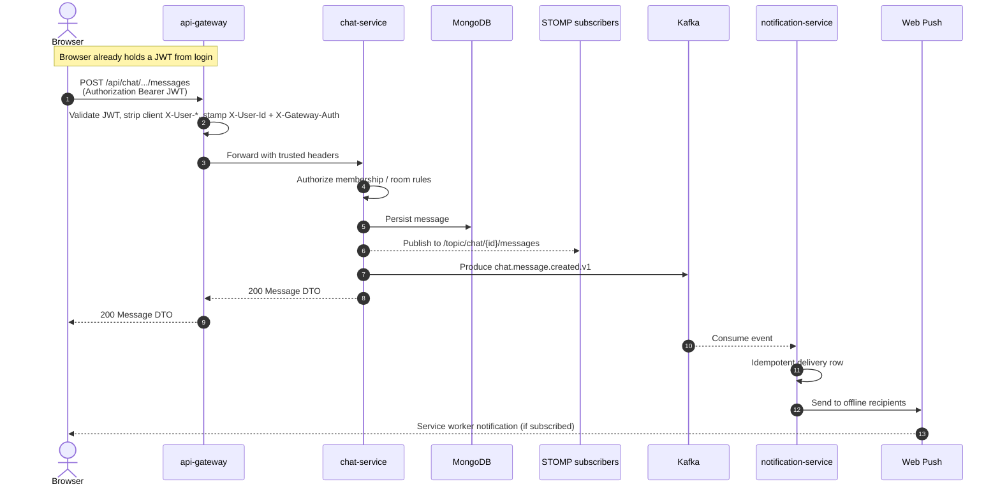

# Sequence — send message → real-time + push

Happy path after the sender is already authenticated (JWT in browser).

WebSocket delivery and Kafka publication are sequential fan-out from chat-service after persist (same request path), not a classic Observer framework.
